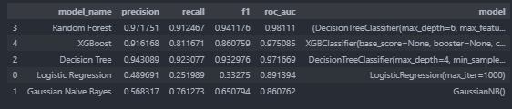

# Overview
This project analyzes employee turnover at Salifort Motors, a fictional automotive company. The goal is to identify key factors contributing to turnover and build a predictive model to classify employees as likely to stay or leave. Information about the datasets can be found at [here](https://www.kaggle.com/datasets/mfaisalqureshi/hr-analytics-and-job-prediction)

# Quick Start
Clone this project and navigate to the project directory.

Run [`setup.bat`](setup.bat) (Windows) or [`setup.sh`](setup.sh) (Unix) to create a virtual environment and install dependencies.

# Structure
- [`data/`](data/): Contains the employee turnover dataset.
- [`Analysis/`](Analysis/): Jupyter notebook with data analysis and predictive modeling.
- [`Deliverables/`](Deliverables/): Contains the final report and presentation slides.

# Executive Summary

Based on the analysis of employee turnover at Salifort Motors, we identified several key factors contributing to turnover, including job satisfaction, work-life balance, and compensation. The best predictive model, which is Random Forest, achieved an F1 score of 94%, indicating a strong ability to classify employees as likely to stay or leave. 

**Recommendations includes**:
* Cap the number of projects that employees can work on.
* Consider promoting employees who have been with the company for atleast four years, or conduct further investigation about why four-year tenured employees are so dissatisfied. 
* Either reward employees for working longer hours, or don't require them to do so. 
* If employees aren't familiar with the company's overtime pay policies, inform them about this. If the expectations around workload and time off aren't explicit, make them clear. 
* Hold company-wide and within-team discussions to understand and address the company work culture, across the board and in specific contexts. 
* High evaluation scores should not be reserved for employees who work 200+ hours per month. Consider a proportionate scale for rewarding employees who contribute more/put in more effort. 